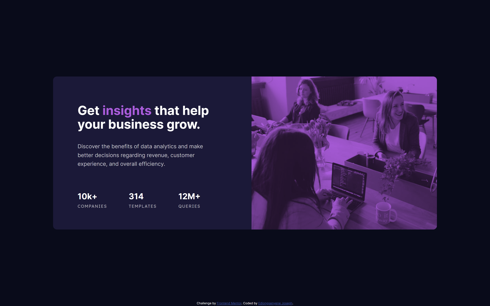

# Frontend Mentor - Stats preview card component solution

This is a solution to the [Stats preview card component challenge on Frontend Mentor](https://www.frontendmentor.io/challenges/stats-preview-card-component-8JqbgoU62). Frontend Mentor challenges help you improve your coding skills by building realistic projects.

## Table of contents

- [Overview](#overview)
  - [The challenge](#the-challenge)
  - [Screenshot](#screenshot)
  - [Links](#links)
- [My process](#my-process)
  - [Built with](#built-with)
  - [Continued development](#continued-development)
  - [Useful resources](#useful-resources)
- [Author](#author)
- [Acknowledgments](#acknowledgments)

## Overview

### The challenge

- My first major challenge was getting the blend mode right on the image.
- Making the card responsive and not just good at particular breakpoints. I used variable font unit along with media queries to solve this.

Users should be able to:

- View the optimal layout depending on their device's screen size

### Screenshot

### Links

- Solution URL: [solution](https://www.frontendmentor.io/solutions/mobilefirst-preview-card-component-using-variable-fonts-html-and-css-y44D1x-HM)
- Live Site URL: [live site](https://iediong.github.io/fem-stats-preview-card-component/)

## My process

### Built with

- Semantic HTML5 markup
- CSS custom properties
- Flexbox
- Mobile-first workflow

### Continued development

- Naming convention like BEM
- Screenreader only text
- SASS
- React

### Useful resources

- [Flexbox Basics Playlist by Kevin Powell](https://youtube.com/playlist?list=PL4-IK0AVhVjMSb9c06AjRlTpvxL3otpUd) - This helped me with the layout.

## Author

- Frontend Mentor - [@iediong](https://www.frontendmentor.io/profile/iediong)
- Twitter - [@iediong](https://www.twitter.com/iediong)

## Acknowledgments

I want to thank Google, MDN Docs and w3schools for helping me out in this challenge.
